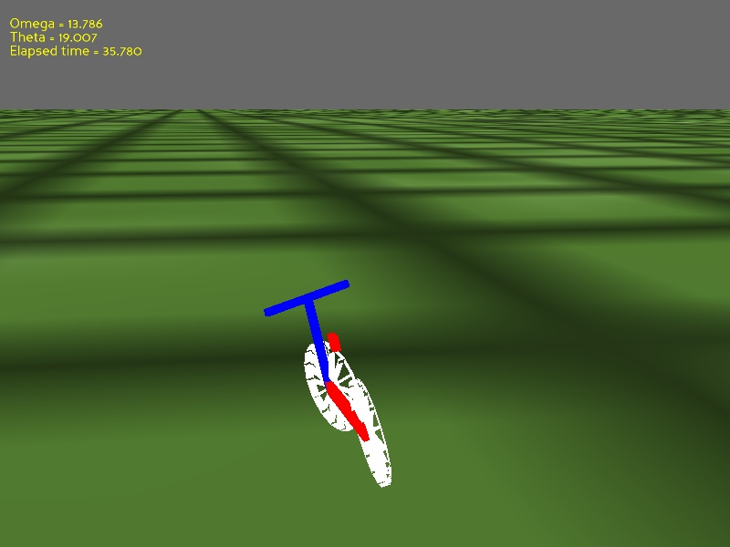

# Controlling bicycle using DDPG

# Requirement
- Python 2.7 or 3.5
- Pandas3D for simmulation
- Tensorflow 1.4
# Add a custom environment to Gym AI
Follow the link: https://github.com/openai/gym/wiki/Environments
# Link
https://github.com/chrisdembia/agent-bicycle
